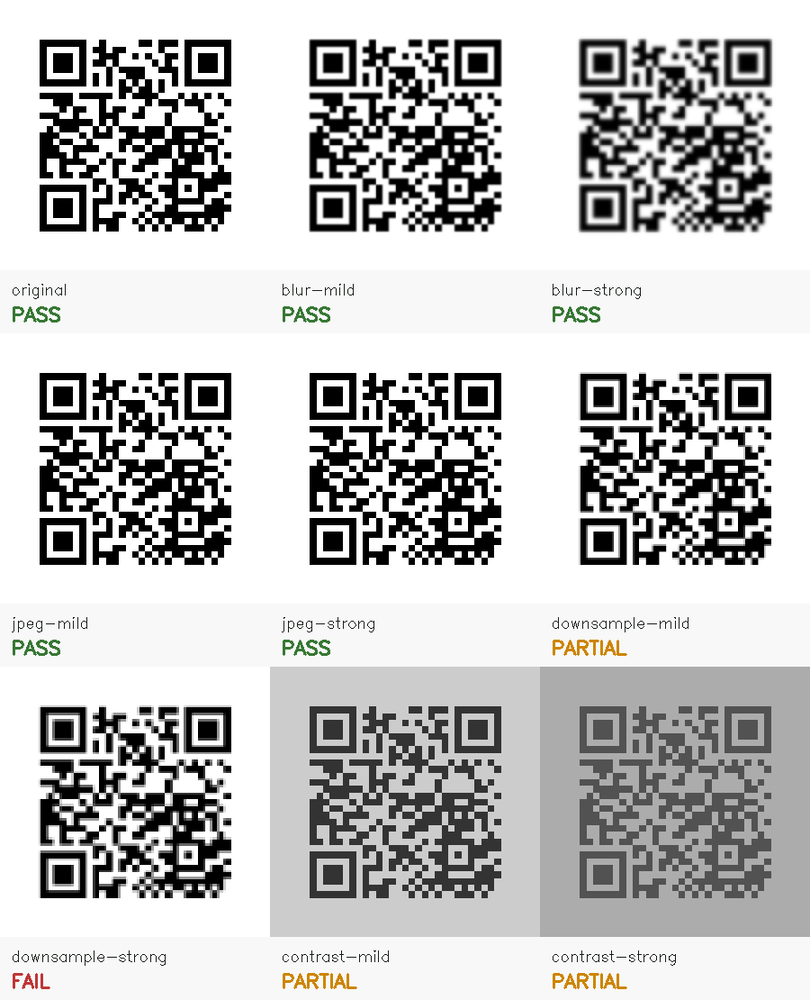

# QRFlight

[](https://github.com/KanadeK/qrflight/actions/workflows/ci.yml)
[](https://www.python.org/)
[](LICENSE)

**屏幕上能扫，不代表排版、压缩和印刷后还能扫。**

QRFlight 是一个完全离线的二维码印前预检 CLI。它用 OpenCV 与 ZXing-C++ 读取真实图片，
测量静区、模块像素、对比度和可选的打印点数，再对模糊、JPEG、降采样和低对比场景逐一
生成真实退化图并重新双解码。

[English](README.md)



上图不是界面模型：每格都是对应参数生成的实际图片，PASS/PARTIAL/FAIL 来自两个解码器对
该图片的真实结果。

> QRFlight 是工程预检工具，不是校准过的 ISO/IEC 15415 验证设备，也不保证所有手机、
> 打印机、纸张和光照组合都可扫。

## 五分钟上手

需要 Python 3.12+ 与 [uv](https://docs.astral.sh/uv/)。

```powershell
git clone https://github.com/KanadeK/qrflight.git
cd qrflight
uv sync --locked --extra dev

# 健康样例，退出 0。
uv run qrflight check examples/healthy.png --profile quick

# 故意裁掉静区的样例，warning 作为门禁时退出 1。
uv run qrflight check examples/cropped.png --profile quick --fail-on warning

# 不只要求“能扫”，还要求内容完全一致。
uv run qrflight check examples/healthy.png --expect https://github.com/KanadeK/qrflight

# 生成无需联网、无 JavaScript 的自包含 HTML 证据报告。
uv run qrflight check examples/healthy.png --format html --output healthy-report.html
```

v0.1.0 发布后可直接安装 Release wheel：

```powershell
pipx install https://github.com/KanadeK/qrflight/releases/download/v0.1.0/qrflight-0.1.0-py3-none-any.whl
```

## 真正检查什么

| 证据 | 输出 | 修复方向 |
| --- | --- | --- |
| 基线双解码 | 两个引擎读到的 payload | 不可读或不一致时重新生成 |
| 静区 | 四边连续净空模块数（最多测到 4） | 四边都补足白边 |
| 模块栅格 | 每模块像素与非整数缩放 | 按模块网格的整数倍导出 |
| 对比度 | 黑白平均亮度差 | 加深前景或减淡背景 |
| 实体打印估算 | 根据宽度与 DPI 计算每模块打印点数 | 放大印刷或提高 DPI |
| 鲁棒性场景 | 每个退化下的双引擎结果 | 从第一个 PARTIAL/FAIL 场景修复 |

只有提供实体宽度时才估算打印点数，不会猜：

```powershell
uv run qrflight check artwork.png --print-width-mm 24 --printer-dpi 300
```

`--print-width-mm` 表示包含静区在内的整张输入图片的印刷宽度。

## Profile、报告与退出码

- `quick`：四种退化各一个场景。
- `print`（默认）：四种退化各有 mild/strong 两级。

支持 `text`、版本化 `json` 与自包含 `html`。HTML 会转义文件名和 payload，不含脚本，不会访问
二维码链接。

| 退出码 | 含义 |
| ---: | --- |
| 0 | 分析完成，没有 finding 达到 `--fail-on` |
| 1 | 分析完成，至少一个 finding 达到门槛 |
| 2 | 参数、输入格式/读取或输出写入错误 |

默认 `--fail-on error`；印前严格门禁使用 `--fail-on warning`；只收集证据使用
`--fail-on none`。

## 验收与失败修复

```powershell
uv run python scripts/verify.py
```

它会执行格式、lint、严格类型、分支覆盖率、wheel/sdist 构建与元数据检查，并在全新虚拟环境中
安装 wheel 后运行命令。完整验收命令、预期退出码和逐项修复流程见
[docs/ACCEPTANCE.md](docs/ACCEPTANCE.md)。

架构见 [docs/architecture.md](docs/architecture.md)，安全边界见
[docs/threat-model.md](docs/threat-model.md)，选题与竞品证据见
[docs/research.md](docs/research.md)。贡献指南见 [CONTRIBUTING.md](CONTRIBUTING.md)，安全问题请按
[SECURITY.md](SECURITY.md) 私密报告。项目采用 MIT License。
